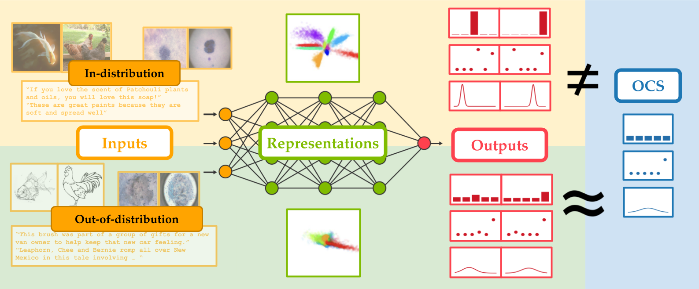

# Deep Neural Networks Tend To Extrapolate Predictably
Code for reproducing the experiments in [Deep Neural Networks Tend To Extrapolate Predictably]().

## Setup
To install the necessary packages for this codebase, run:
```
conda create -n cautious_extrapolation python=3.7
conda activate cautious_extrapolation
pip install -e .
```
To download the datasets needed for training, please follow the directions specified in the following links:
- [CIFAR10](https://www.cs.toronto.edu/~kriz/cifar.html),  [CIFAR10-C](https://zenodo.org/record/2535967)
- [ImageNet](https://www.image-net.org/download.php), [ImageNet-R(endition)](https://github.com/hendrycks/imagenet-r), [ImageNet-Sketch](https://github.com/HaohanWang/ImageNet-Sketch)
- [MNIST](https://pytorch.org/vision/0.15/datasets.html)
- [OfficeHome](https://github.com/facebookresearch/DomainBed)
- [SkinLesionPixels](https://github.com/fregu856/regression_uncertainty)
- [UTKFace](https://www.kaggle.com/datasets/nipunarora8/age-gender-and-ethnicity-face-data-csv)
- [Amazon](https://wilds.stanford.edu/get_started/)
Update `cautious_extrapolation/data_paths.py` to include the directory paths in which the datasets were downloaded.
## Usage
This codebase is organized such that each dataset is associated with a folder inside `cautious_extrapolation\`. To train a model on a particular dataset, navigate to the folder associated with the  dataset, and run:
```
python train.py [args]
```
To evaluate the model on the holdout and OOD datasets, run:
```
python eval.py --run-name=[run name] [other args]
```
To reproduce the figures in our paper, please see `plot.ipynb` and `analyze.ipynb`.
## Acknowledgements
The codebase is built on top of multiple publicly available repos:
- [pytorch_resnet_cifar10](https://github.com/akamaster/pytorch_resnet_cifar10)
- [wilds](https://github.com/p-lambda/wilds)
- [examples](https://github.com/pytorch/examples)
- [DomainBed](https://github.com/facebookresearch/DomainBed)
- [UTK-Face](https://github.com/ArminBaz/UTK-Face)
- [regression_uncertainty](https://github.com/fregu856/regression_uncertainty)